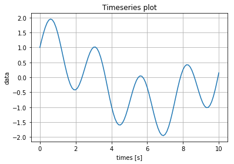
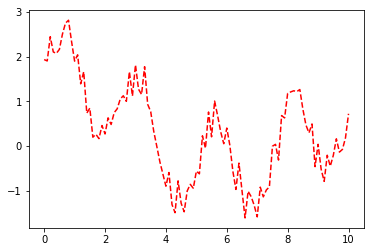
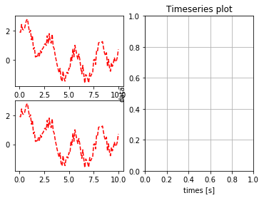
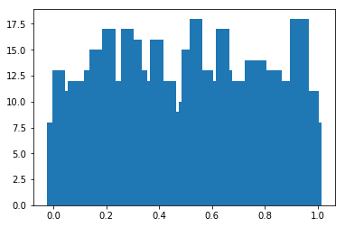

```python
import numpy as np # C array랑 유사
```


```python
a=np.array([1,2,3,4])
```


```python
print(a)
```

    [1 2 3 4]
    


```python
print(a[1:3])
```

    [2 3]
    


```python
mat = np.array([[1,2,3],[4,5,6]]) 
mat = np.array([[1,2,3],[4,5]]) #array of list (차원이 다를때는)
```


```python
print(mat)
```

    [[1 2 3]
     [4 5 6]]
    


```python
mat_list=[[1,2,3],[4,5,6]]
```


```python
print(mat_list)
```

    [[1, 2, 3], [4, 5, 6]]
    


```python
print(mat_list[1][1])
```

    5
    


```python
print(mat[1,1]) #새로운 인덱싱 방법 / 두번째 꺼의 두번째 원소
```

    5
    


```python
print(mat[1,:])
```

    [4 5 6]
    


```python
print(mat[:,0])
```

    [1 4]
    


```python
a+2
```


    array([3, 4, 5, 6])


```python
a*2 #각각 원소에 곱해짐
```


    array([2, 4, 6, 8])


```python
np.append(a,a) # a에다가 a를
```


    array([1, 2, 3, 4, 1, 2, 3, 4])


```python
np.vstack([a,a]) #vertical stack
```


    array([[1, 2, 3, 4],
           [1, 2, 3, 4]])


```python
np.hstack([a,a]) #horizental stack
```


    array([1, 2, 3, 4, 1, 2, 3, 4])


```python
np.append(a,a,axis=0) #axis=0 : 열 연산
```


    array([1, 2, 3, 4, 1, 2, 3, 4])


```python
np.append(a,a,axis=1) # axis=1 : 행 연산 / 1*n 배열이라서 2번째 행 존재 x
```


    ---------------------------------------------------------------------------

    IndexError                                Traceback (most recent call last)

    <ipython-input-22-3384c4ceba29> in <module>()
    ----> 1 np.append(a,a,axis=1)
    

    C:\Users\wooli\Anaconda3\lib\site-packages\numpy\lib\function_base.py in append(arr, values, axis)
       5001         values = ravel(values)
       5002         axis = arr.ndim-1
    -> 5003     return concatenate((arr, values), axis=axis)
    

    IndexError: axis 1 out of bounds [0, 1)


```python
np.append(a[:,np.newaxis], a[:,np.newaxis], axis=1)
```


    array([[1, 1],
           [2, 2],
           [3, 3],
           [4, 4]])


```python
np.stack([a,a],axis=1)
```


    array([[1, 1],
           [2, 2],
           [3, 3],
           [4, 4]])


```python
?? np.stack
```


```python
np.append(a,'string')
```


    array(['1', '2', '3', '4', 'string'], 
          dtype='<U11')


```python
mat=np.array([[1,2],[3,4]])
```


```python
mat
```


    array([[1, 2],
           [3, 4]])


```python
mat*mat #원소별로 곱해짐
```


    array([[ 1,  4],
           [ 9, 16]])


```python
mat.dot(mat) #행렬곱
```


    array([[ 7, 10],
           [15, 22]])


```python
v1=[1,0,0]
v2=[0,1,0]
np.dot(v1,v2)
```


    0


```python
np.cross(v1,v2)
```


    array([0, 0, 1])


```python
mat.T #transpose
```


    array([[1, 3],
           [2, 4]])


```python
np.linalg.inv(mat) #inverse
```


    array([[-2. ,  1. ],
           [ 1.5, -0.5]])


```python
np.linalg.det(mat)
```


    -2.0000000000000004


```python
A=np.array([[1,3],[1,5]])
y=np.array([5,7])
x=np.linalg.inv(A).dot(y)
print(x) # float라 뒤에 .
```

    [ 2.  1.]
    


```python
np.dot(A,x)
```


    array([ 5.,  7.])


```python
t=np.linspace(0,10,100) #0부더 10사이를 100개로 나눔
```


```python
print(t)
```

    [  0.    0.1   0.2   0.3   0.4   0.5   0.6   0.7   0.8   0.9   1.    1.1
       1.2   1.3   1.4   1.5   1.6   1.7   1.8   1.9   2.    2.1   2.2   2.3
       2.4   2.5   2.6   2.7   2.8   2.9   3.    3.1   3.2   3.3   3.4   3.5
       3.6   3.7   3.8   3.9   4.    4.1   4.2   4.3   4.4   4.5   4.6   4.7
       4.8   4.9   5.    5.1   5.2   5.3   5.4   5.5   5.6   5.7   5.8   5.9
       6.    6.1   6.2   6.3   6.4   6.5   6.6   6.7   6.8   6.9   7.    7.1
       7.2   7.3   7.4   7.5   7.6   7.7   7.8   7.9   8.    8.1   8.2   8.3
       8.4   8.5   8.6   8.7   8.8   8.9   9.    9.1   9.2   9.3   9.4   9.5
       9.6   9.7   9.8   9.9  10. ]
    


```python
y=np.sin(2.5*t)+np.cos(0.5*t)
```


```python
import matplotlib.pyplot as plt
%matplotlib inline
```


```python
plt.plot(t,y)
plt.xlabel('times [s]')
plt.ylabel('data')
plt.title('Timeseries plot')
plt.grid(True)
```





```python
y_noise=y+np.random.random(len(y))
```


```python
fig=plt.figure()
plt.plot(t,y_noise,'r--')
plt.figure() # 나눠서 그리기 / 없을 경우 겹쳐서 그려진다
plt.plot(t,y)
plt.xlabel('times [s]')
plt.ylabel('data')
plt.title('Timeseries plot')
plt.grid(True)
```





```python
fig=plt.figure()
plt.subplot(221) # 2*2에서 첫번째 위치
plt.plot(t,y_noise,'r--')
plt.subplot(223) #2*2에서 세번째 위치
plt.plot(t,y_noise,'r--')
plt.subplot(122) #1*2에서 두번째 위치
plt.xlabel('times [s]')
plt.ylabel('data')
plt.title('Timeseries plot')
plt.grid(True)
```





```python
r=np.random.random(1000)
hist=np.histogram(r,100)

```


```python
print(hist)
```

    (array([2, 0, 0, 0, 0, 1, 0, 0, 0, 0, 0, 0, 0, 0, 0, 0, 0, 0, 0, 0, 0, 0, 0,
           0, 1, 1, 0, 0, 0, 0, 0, 0, 1, 0, 0, 0, 0, 0, 0, 0, 0, 0, 0, 0, 0, 0,
           0, 0, 0, 0, 0, 0, 0, 0, 0, 2, 0, 0, 0, 0, 0, 0, 0, 0, 0, 0, 0, 0, 0,
           0, 0, 0, 0, 1, 0, 0, 0, 0, 0, 0, 0, 0, 0, 0, 0, 0, 0, 0, 0, 0, 0, 0,
           0, 0, 0, 0, 0, 0, 0, 1], dtype=int64), array([ 0.14767473,  0.15582409,  0.16397346,  0.17212282,  0.18027218,
            0.18842154,  0.1965709 ,  0.20472026,  0.21286962,  0.22101899,
            0.22916835,  0.23731771,  0.24546707,  0.25361643,  0.26176579,
            0.26991515,  0.27806452,  0.28621388,  0.29436324,  0.3025126 ,
            0.31066196,  0.31881132,  0.32696068,  0.33511004,  0.34325941,
            0.35140877,  0.35955813,  0.36770749,  0.37585685,  0.38400621,
            0.39215557,  0.40030494,  0.4084543 ,  0.41660366,  0.42475302,
            0.43290238,  0.44105174,  0.4492011 ,  0.45735047,  0.46549983,
            0.47364919,  0.48179855,  0.48994791,  0.49809727,  0.50624663,
            0.514396  ,  0.52254536,  0.53069472,  0.53884408,  0.54699344,
            0.5551428 ,  0.56329216,  0.57144152,  0.57959089,  0.58774025,
            0.59588961,  0.60403897,  0.61218833,  0.62033769,  0.62848705,
            0.63663642,  0.64478578,  0.65293514,  0.6610845 ,  0.66923386,
            0.67738322,  0.68553258,  0.69368195,  0.70183131,  0.70998067,
            0.71813003,  0.72627939,  0.73442875,  0.74257811,  0.75072748,
            0.75887684,  0.7670262 ,  0.77517556,  0.78332492,  0.79147428,
            0.79962364,  0.807773  ,  0.81592237,  0.82407173,  0.83222109,
            0.84037045,  0.84851981,  0.85666917,  0.86481853,  0.8729679 ,
            0.88111726,  0.88926662,  0.89741598,  0.90556534,  0.9137147 ,
            0.92186406,  0.93001343,  0.93816279,  0.94631215,  0.95446151,
            0.96261087]))
    


```python
plt.bar(hist[1][:-1], hist[0],.05)
```


    <Container object of 100 artists>





```python
np.std(y)
```


    0.99695656545396605


```python
np.
```


```python

```


```python

```


```python

```


```python

```


```python

```


```python

```
